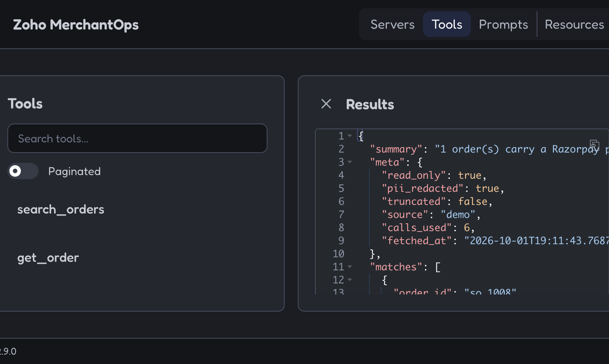

# Zoho MerchantOps MCP

A read-only MCP server for an Indian Razorpay merchant. The agent asks “what should I worry about today?” and gets one answer that joins Zoho stock, invoices, shipments, and a Razorpay payment id. It does not wrap Zoho’s REST API as a pile of create and list tools.

Repository: [sanikachavan1806-code/merchant-desk-zoho-mcp](https://github.com/sanikachavan1806-code/merchant-desk-zoho-mcp)

The MCP server is the product. Two pages on the same local process show it working.

| Site | Address | What you do there |
| --- | --- | --- |
| Merchant desk | [http://127.0.0.1:8787](http://127.0.0.1:8787) | Ask a question, open a card, see the 30-day chart and the warehouse floor |
| Inspector | [http://127.0.0.1:8787](http://127.0.0.1:8787) → **Inspector** | List all 21 tools, resources, and prompts, then run a call and read the JSON |

Start both with `merchantops-desk`. The header switch is **Desk** and **Inspector**. They call the same server.

## MCP

An agent connects over stdio or streamable HTTP. Demo mode needs no Zoho account. The fixture merchant is Mira Audio, Mumbai and Bengaluru, on 1 October 2026.

```bash
merchantops
```

```json
{
  "mcpServers": {
    "zoho-merchantops": {
      "command": "merchantops",
      "env": { "ZOHO_MODE": "demo" }
    }
  }
}
```

Streamable HTTP:

```bash
merchantops --transport streamable-http
```

Endpoint: [http://127.0.0.1:8000/mcp](http://127.0.0.1:8000/mcp)

What the server exposes:

- **21 tools.** Judgment first (`get_daily_operations_brief`, `detect_operational_risks`, `get_order_health`, `recommend_next_actions`, `reconcile_orders`, `match_order_to_payment`, `dead_stock`, `gst_summary`, `detect_anomalies`). List tools are for a known order, SKU, or warehouse, with a page cap of 50.
- **3 resources.** `zoho://org/warehouses`, `zoho://org/api-budget`, `zoho://org/capabilities`.
- **4 prompts.** `daily_ops_brief`, `orders_at_risk`, `paid_not_shipped`, `paid_not_invoiced`.
- **One envelope.** `summary`, then `meta.read_only`, `meta.pii_redacted`, `meta.truncated`, `meta.calls_used`, `meta.source` (`demo` or `zoho`), `meta.fetched_at`, `meta.sources`. Errors are the same shape, with `error.code` and `error.message`, not a traceback.
- **Read only.** The process exits if `READ_ONLY=false`. The HTTP client allows `GET` only. `propose_action` records a write and returns `executed: false`.
- **Quota.** Zoho Inventory allows [100 requests per minute per organization](https://www.zoho.com/inventory/api/v1/introduction/), and a daily cap of 1,000 / 2,000 / 5,000 / 10,000 by plan. This client stays near 80 per minute, 5 at a time. HTTP 429 code **44** backs off and retries. Code **45** stops, `scope=daily`, no retry. `get_api_budget` reports the ceiling before a wide scan.
- **PII.** Phone and email are masked (`r***@example.com`, `******3210`). `include_pii=true` does nothing unless the operator set `ZOHO_REVEAL_PII=true`. Notes are dropped after Razorpay ids are extracted. The audit line stores tool, status, and latency, not search text or contact fields.
- **OAuth.** Read scopes only (`ZohoInventory.salesorders.READ` and the other `.READ` scopes). `access_type=offline`. Refresh tokens are encrypted. Every call sends `Authorization: Zoho-oauthtoken` and `organization_id`. Eight datacenters; Indian merchants use `ZOHO_DC=in`.

The contract, including every error string, is [docs/TOOL_SPEC.md](docs/TOOL_SPEC.md). Can and cannot: [docs/capabilities.md](docs/capabilities.md). Request path: [docs/architecture.md](docs/architecture.md). Scripted answers: [docs/demo-conversation.md](docs/demo-conversation.md).

## Features

These are the questions the desk cards and the MCP tools answer for Mira Audio.

| Question | Tool | What the demo shows |
| --- | --- | --- |
| What needs attention today? | `get_daily_operations_brief` | 6 open orders, ₹27,082 |
| Which orders are at risk? | `detect_operational_risks` | Mumbai earbuds, about 4 days of cover |
| Why earbuds? | `explain_recommendation` | 8 available, 14 sold in 7 days, cover 4.0 |
| What’s wrong with SO-1002? | `get_order_health` | AT_RISK |
| Can Bengaluru ship 6 speakers? | `find_alternate_fulfillment` | Bengaluru has 4. Mumbai can cover 6 |
| Which paid orders have no invoice? | `match_order_to_payment` | SO-1008, `pay_NotInvoiced1008` |
| Which paid orders have not shipped? | `reconcile_orders` | SO-1010 in `paid_not_shipped` |
| Open invoices | `list_invoices` | INV-1005 ₹3,998 unpaid, INV-1006 overdue, INV-1007 ₹150 |
| Shipments | `list_shipments` | SHP-1005, SHP-1006, SHP-1007 |
| GST for September | `gst_summary` | ₹1,812.15 (₹1,797.15 at 18%, ₹15.00 at 5%) |
| Cash tied up in unsold stock | `dead_stock` | SKU-STAND-OLD, ₹10,000 |
| Anything unusual? | `detect_anomalies` | Order spike, cable at ₹99 vs ₹299, failed-then-paid on SO-1010 |
| Low stock | `list_inventory` | Only SKU-EARBUD-PRO. Speakers are short in Bengaluru, not low in total |
| Customer phone and email | `get_customer` | Masked |
| Move stock | `propose_action` | Refused. Nothing is written |
| API budget | `get_api_budget` | Logical reads against the 1,000 free-plan ceiling |

The desk also draws the past 30 days (2 Sep–1 Oct 2026): 37 orders, order value, and the busiest day. **Open floor** is a second window for Mumbai and Bengaluru: rack blocks, available in green, remaining in red, shipments, and orders still to ship.

`match_order_to_payment` and `reconcile_orders` do not call Razorpay’s API. They use the payment id already stored on the Zoho order. Without an export, that id is `referenced_not_verified`. GST here is invoice tax, not a filed return.

## Run

```bash
python3 -m venv .venv
source .venv/bin/activate
pip install -e ".[dev]"
pytest
python -m merchantops.demo.smoke
merchantops-desk
```

Then open the desk and the Inspector at [http://127.0.0.1:8787](http://127.0.0.1:8787).

Smoke checks the story above and the error envelopes (`not_found`, `invalid_argument`, page cap, refused transfer). It exits non-zero if a number drifts. No Zoho account is called.

A configured organization, two reads only:

```bash
python -m merchantops.demo.smoke --live
```

Official MCP Inspector against the same binary:

```bash
npx @modelcontextprotocol/inspector --cli .venv/bin/merchantops --method tools/list -e ZOHO_MODE=demo
```

`match_order_to_payment` with `only_paid_not_invoiced: true` returns SO-1008.



## Live Zoho

Copy `.env.example` to `.env`.

Self-client: `ZOHO_MODE=live`, `ZOHO_DC=in`, `ZOHO_ORGANIZATION_ID`, and `ZOHO_ACCESS_TOKEN`. Add `ZOHO_REFRESH_TOKEN` plus the client id and secret when the access token should refresh.

Browser consent:

```bash
export TOKEN_ENCRYPTION_KEY="$(python -c 'from cryptography.fernet import Fernet; print(Fernet.generate_key().decode())')"
merchantops-auth login
```

`ZOHO_DC` is `us`, `eu`, `in`, `au`, `jp`, `ca`, `sa`, or `cn`. A token `api_domain` is accepted only for those Zoho API hosts. Set `ZOHO_DAILY_LIMIT` when the organization’s plan does not match the introduction numbers. Set `RAZORPAY_EXPORT_PATH` to a payments export when you have one.

## Layout

```text
src/merchantops/
  server.py        MCP tools, resources, prompts
  service.py       pagination, cache, audit, envelopes
  intelligence.py  health, risks, days of cover
  finance.py       reconcile, dead stock, GST, anomalies
  zoho/            read-only client, normalizer, 429 policy
  auth/            OAuth, refresh, encrypted token store
  demo/            Mira Audio fixture and smoke proof
  web/             desk and Inspector
docs/TOOL_SPEC.md  tools, envelopes, every error string
```

`pytest` covers the per-minute retry, the daily fail-fast, token refresh, masked PII, the 4.0 day cover, the SO-1008 match, and the 21-tool MCP surface.
